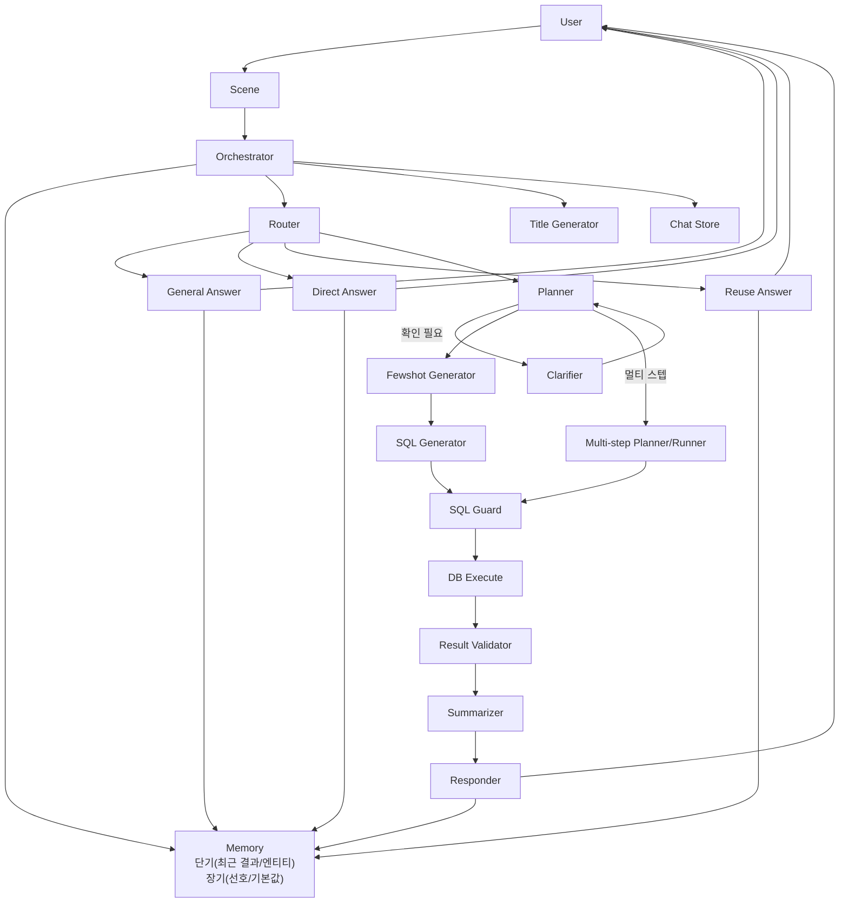

# NBA NL2SQL 챗봇 (SQLite + Streamlit)

NBA SQLite DB를 기반으로 자연어 질의를 SQL로 변환하고, 결과를 표/요약/차트로 제공하는 프로젝트입니다. 지표 정의는 `src/metrics/metrics.yaml`에 한글로 주입되어 코드 수정 없이 확장할 수 있습니다.

## 주요 기능

- **Scene/Orchestrator 구조**로 Streamlit/로컬 러너가 동일한 경로로 실행됩니다.
- **LLM 라우터 + 플래너 + SQL 생성/가드 + 요약**까지 end-to-end 파이프라인 제공.
- **단기/장기 메모리 분리**로 멀티턴 문맥과 사용자 선호(기본 시즌 등) 유지.
- **SQL Guard + 결과 검증 재시도**로 안정성 강화.
- **이전 결과 재사용(정렬/필터/Top-K)** 및 일반 안내 응답 지원.
- **멀티스텝 플래닝**으로 복합 질의를 단계별 SQL로 처리.
- 멀티스텝 질의는 **단일 SQL(CTE + JOIN)로 합성 가능한 경우 1번의 SQL로 실행**하고,
  그렇지 않으면 단계별 SQL 실행 후 결과를 결합합니다.
- **Thinking 패널 실시간 업데이트**: 실행 중인 Agent만 ⏳, 완료 시 ✅ 표시.
- **최종 답변 스트리밍**으로 자연스러운 출력 경험 제공.
- **차트 자동 생성**: 그래프/차트 요청 시 📊 차트 섹션에 렌더링.

## 데이터 출처

- Kaggle: https://www.kaggle.com/datasets/wyattowalsh/basketball

## 데이터셋 상세

### 포함 테이블

- game, game_info, game_summary, line_score, other_stats
- team, team_info_common, team_details, team_history
- common_player_info, player, inactive_players
- draft_history, draft_combine_stats
- play_by_play
- officials

### 제공 가능한 범위

- 팀 경기 스탯 기반 지표(득점/리바운드/어시스트/슈팅 효율 등)
- 팀 비교/순위/트렌드(시즌/기간 기준)
- 관중/흥행 지표(경기/팀 기준 집계)
- 드래프트/컴바인/선수 프로필 정보
- 플레이바이플레이 이벤트 기반 간접 지표(동시 관여 빈도 등)

### 제한 사항

- 선수 경기 로그(월별/경기별 득점·출전시간·슛 성공률) 테이블이 없어 해당 질의는 정확히 지원되지 않습니다.
- 질문이 데이터 범위를 벗어나면 확인 질문 또는 대체 제안을 제공합니다.

## 환경 설정

`.env`에 API 키와 실행 환경을 정의합니다.

```env
OPENAI_API_KEY=YOUR_KEY_HERE
OPENAI_MODEL=gpt-4.1-mini
FINAL_ANSWER_MODEL=gpt-4.1-nano
OPENAI_TEMPERATURE=0.2
DB_PATH=data/nba.sqlite
MEMORY_DB_PATH=result/memory.sqlite
CHAT_DB_PATH=result/chat.sqlite
FEWSHOT_CANDIDATE_LIMIT=3
```

## 실행 방법

```bash
streamlit run src/app.py
```

## 스키마 덤프

Streamlit 사이드바의 **Dump Schema** 버튼을 누르거나 아래 명령을 실행합니다.

```bash
python -m src.db.schema_dump
```

생성 파일:
- `result/schema.json`
- `result/schema.md`

## Streamlit UI

- **모델 선택**: `gpt-4.1-mini` 기본값, `gpt-4.1-nano`/`gpt-4o-mini` 선택 가능
- **최종 답변 모델**: `FINAL_ANSWER_MODEL`로 고정(기본 `gpt-4.1-nano`)
- **Dataset Info**: 데이터셋 요약/출처/테이블/지표 목록 표시
- **추천 질의**: 클릭으로 빠른 질문 실행
- **결과 요약 카드**: Rows/Season/Metric/Top-K 표시
- **표 출력 정책**: 응답 본문 마크다운 테이블과 CSV 다운로드가 동일한 데이터를 사용
- **차트 출력**: 그래프/차트/시각화 요청 시 📊 차트 섹션 자동 렌더링
- **차트 이미지 저장**: `result/plot/{user_id}/{chat_id}/` 경로에 PNG 저장(깃 추적 제외)
- **채팅 목록**: 좌측 사이드바에서 채팅 선택/제목 수정/삭제 가능
- **Thinking**: 라우팅/플래닝/SQL 진행 상태를 실시간 ⏳/✅로 표시(Details 토글)

지원 차트 유형: `line`, `area`, `bar`, `stacked_bar`, `scatter`, `histogram`, `box`

## 로컬 테스트 (Streamlit 없이)

Streamlit과 동일한 Scene/오케스트레이터 구성으로 로컬 실행합니다.

```bash
python src/test/test_agent_flow.py
```

## 단위 테스트

더미 구성으로 체인 로직만 빠르게 검증합니다.

```bash
python src/test/test_chain_unit.py
```

## 예시 질문

### 지표 정의 질문 (Direct Answer)
1. "TS% 뭐야?"
2. "트리플더블 정의 알려줘"
3. "eFG% 계산식은?"
4. "백투백 기준이 뭐야?"
5. "승률 계산 공식 설명해줘"

### 데이터 질의 질문 (SQL)
1. "2023-24 시즌 팀 득점 상위 10개 보여줘"
2. "LAL 최근 5경기 결과 알려줘"
3. "접전 경기(5점 이하) 최근 10개 보여줘"
4. "팀 평균 리바운드 상위 5팀 알려줘"
5. "관중 수 상위 10경기 알려줘"

### 멀티턴 예시
1. "최근 리그에서 승률 상위 5개 팀 알려줘" → "상위 3개만"
2. "앞으로 기본 시즌은 2023-24로 해줘" → "승률 상위 5팀 보여줘"

## 메모리 구조

- **단기 메모리**: 마지막 SQL/결과/슬롯 + 최근 대화 일부를 유지합니다(채팅 세션 단위).
- **단기 메모리 엔티티**: 직전 결과에서 추출한 팀/선수 목록을 저장해 후속 질의를 보강합니다.
- **장기 메모리**: 자주 묻는 시즌/팀/지표 등 선호를 사용자 단위로 SQLite에 누적합니다.

## 채팅 세션

- 채팅 목록은 `CHAT_DB_PATH` SQLite에 저장됩니다.
- 첫 질문 입력 후 제목을 한 번 자동 생성하고 이후 고정합니다.
- 채팅별로 메시지/표/메타가 저장되어 새로고침 없이 복원됩니다.

## 로컬 SQLite 가이드 (Agent 메모리 / Chat 히스토리)

### 생성 시점

- `result/chat.sqlite` (Chat 히스토리): Streamlit 실행 중 최초 채팅 생성 시 자동 생성
- `result/memory.sqlite` (Agent 메모리): 장기 메모리에 선호/프로필 기록 시 자동 생성
- 별도의 수동 생성 작업은 필요하지 않습니다.

### 스키마 요약

- `chat.sqlite` (Chat 히스토리)
  - `chat_sessions`: 채팅 목록 메타(사용자 ID, 제목, 생성/갱신 시각)
  - `chat_messages`: 채팅별 메시지/메타 JSON 기록
- `memory.sqlite` (Agent 메모리)
  - `preference_counts`: 선호 카운트(카테고리, 값, 횟수)
  - `user_profile`: 사용자 기본값(예: 기본 시즌)

## Few-shot 추가 방법

1. 기본 예시는 `src/prompt/sql_generation.py`의 `SQL_FEWSHOT_EXAMPLES`에서 관리합니다.
2. 런타임에는 `FewshotGenerator`가 사용자 질문과 후보 메트릭을 기반으로 few-shot을 동적으로 생성합니다.
3. `FewshotGenerator`는 LLM으로 필요한 테이블/컬럼을 먼저 선별해 스키마 컨텍스트를 축소합니다(실패 시 룰 기반 폴백).
4. `FEWSHOT_CANDIDATE_LIMIT` 환경 변수로 후보 sql_template 개수를 조절할 수 있습니다(기본값 3).
5. 예시에 쓰는 테이블/컬럼은 `result/schema.json`에 존재해야 합니다.
6. 특정 지표의 정확도를 높이려면 `src/metrics/metrics.yaml`의 `aliases`와 `sql_template`를 함께 보강합니다.

예시 추가 패턴:
```
[예시 N] 설명
질문: ...
SQL:
SELECT ...
LIMIT 50;
```

## Agent 아키텍처



### 에이전트 상세 설명

- **Scene (`src/agent/scene.py`)**: Streamlit/로컬 테스트에서 동일한 실행 경로를 제공하는 래퍼입니다. `ask()`로 오케스트레이터를 호출하고, `reset()`으로 대화 메모리를 초기화합니다.
- **Orchestrator (`src/agent/orchestrator.py`)**: 레지스트리/스키마 로드, 체인 구성, 스트리밍 실행을 담당합니다. 예외 발생 시 안전한 폴백 응답을 만들고, 턴 시작/종료 시 메모리를 업데이트합니다.
- **Router (`src/agent/router.py`)**: LLM 라우터가 기본이며 JSON 파싱 실패 시 키워드 폴백을 수행합니다.  
  메트릭 별칭을 통해 Direct/Reuse/SQL_REQUIRED를 분기하고 `route_reason`을 기록합니다.
- **Planner (`src/agent/planner.py`)**: 엔티티/시즌/기간/지표/Top-K 슬롯을 구성하고, 부족하면 `clarify_question`을 제공합니다. 메트릭 누락 시 레지스트리 기준으로 보정/재시도합니다.
- **Clarifier (`src/prompt/clarify.py`)**: 플래너가 부족한 정보를 발견했을 때 확인 질문을 생성합니다.
- **Reuse Answer (`src/agent/router.py` 내 `apply_reuse_rules`)**: 직전 결과에 대해 정렬/필터/Top-K 후처리를 적용합니다.
- **Direct Answer (`src/agent/responder.py`)**: 메트릭 레지스트리 정의를 기반으로 지표 설명 응답을 생성합니다.
- **General Answer (`src/agent/responder.py`)**: 가능한 데이터 범위와 사용법을 일반 안내로 응답합니다.
- **Fewshot Generator (`src/agent/fewshot_generator.py`)**: 후보 메트릭과 질의를 보고 필요한 테이블/컬럼을 선별하고, few-shot 예시를 구성합니다.
- **Multi-step Planner/Runner (`src/agent/multi_step_planner.py`, `src/agent/chain.py`)**: 복합 질의를 단계별 질문으로 분해하고, 단계별 결과를 결합합니다.
- **Multi-step Single SQL (`src/prompt/multi_step_sql.py`)**: 멀티스텝 계획이 JOIN으로 합성 가능한 경우, 한 번의 SQL(CTE + JOIN)로 합성해 실행합니다.
- **SQL Generator (`src/agent/sql_generator.py`)**: 선별된 스키마/메트릭 정의/few-shot을 바탕으로 SQL을 생성합니다.
- **SQL Guard (`src/agent/guard.py`)**: SELECT-only/조건 없는 JOIN 금지/LIMIT 강제 등 안전 규칙을 적용합니다.
- **DB Execute (`src/db/sqlite_client.py`)**: SQL을 실행하고 DataFrame을 반환합니다.
- **Result Validator (`src/agent/validator.py`)**: 0행/컬럼 없음/NULL 과다를 감지해 재시도 여부를 결정합니다.
- **Summarizer (`src/agent/summarizer.py`)**: 조회 결과를 요약하고 분석 포인트를 생성합니다.

## 출력/로그

- `log/` 폴더에 실행 로그를 JSON 형태로 남깁니다(깃 추적 제외).
- 테스트 스크립트 로그도 `log/test_agent_flow_YYYYMMDDhhmmss.log` 형식으로 저장됩니다.

## 참고

- 차트/그래프 이미지는 런타임에 생성되는 산출물이며 Git에 포함되지 않습니다.
