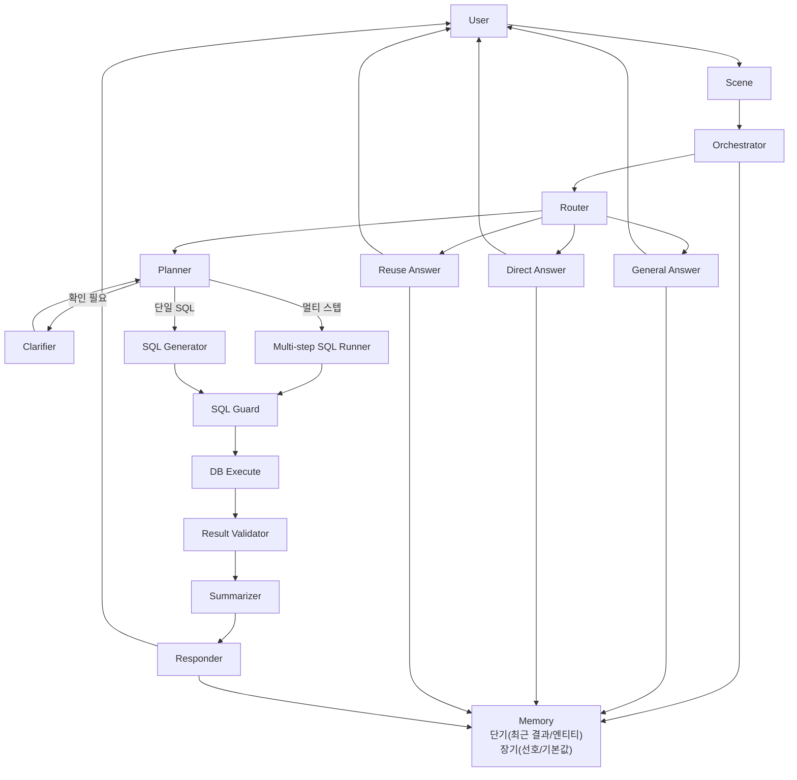

# NBA NL2SQL 챗봇 (SQLite + Streamlit)

NBA SQLite DB를 기반으로 NL2SQL 에이전트를 제공하는 프로젝트입니다. 지표 정의는 `src/metrics/metrics.yaml`에 한글로 상세히 주입되며, 변경 시 코드 수정 없이 반영되도록 설계했습니다.

## 주요 기능

- Scene/Orchestrator 기반으로 Streamlit과 로컬 러너가 동일한 경로로 실행됩니다.
- LLM 라우터 + 플래너 + SQL 생성/가드 + 요약까지 end-to-end 파이프라인을 제공합니다.
- 단기/장기 메모리를 분리해 멀티턴 문맥과 선호(기본 시즌 등)를 관리합니다.
- SQL Guard로 SELECT-only를 강제하고, 품질 검증/재시도를 통해 안정성을 높입니다.
- 이전 결과 재사용(정렬/필터/Top-K)과 일반 안내 답변도 지원합니다.
- 멀티 스텝 플래닝으로 복합 질의를 단계별 SQL로 처리합니다(예: 관중 상위 팀 + 시즌 성적 결합).
- Thinking 패널로 단계별 상태를 확인하며, 최종 답변은 UI 스트리밍으로 출력합니다.

## 데이터 출처

- Kaggle: https://www.kaggle.com/datasets/wyattowalsh/basketball

## 데이터셋 상세

### 포함 테이블

- game, game_info, game_summary, line_score, other_stats
- team, team_info_common, team_details, team_history
- common_player_info, player, inactive_players
- draft_history, draft_combine_stats
- play_by_play
- officials

### 제공 가능한 범위

- 팀 경기 스탯 기반 지표(득점/리바운드/어시스트/슈팅 효율 등)
- 팀 비교/순위/트렌드(시즌/기간 기준)
- 관중/흥행 지표(경기/팀 기준 집계)
- 드래프트/컴바인/선수 프로필 정보
- 플레이바이플레이 이벤트 기반 간접 지표(동시 관여 빈도 등)

### 제한 사항

- 선수 경기 로그(월별/경기별 득점·출전시간·슛 성공률) 테이블이 없어 해당 질의는 정확히 지원하지 않습니다.
- 질문이 데이터 범위를 벗어나면 확인 질문 또는 대체 제안을 제공합니다.

## 환경 설정

`.env` 파일에 API 키를 설정합니다(실제 키는 노출하지 마세요).

```
OPENAI_API_KEY=YOUR_KEY_HERE
OPENAI_MODEL=gpt-4o-mini
OPENAI_TEMPERATURE=0.2
DB_PATH=data/nba.sqlite
MEMORY_DB_PATH=result/memory.sqlite
```

## 스키마 덤프

Streamlit 사이드바의 **Dump Schema** 버튼을 누르거나 아래 명령을 실행합니다.

```
python -m src.db.schema_dump
```

생성 파일:
- `result/schema.json`
- `result/schema.md`

## 실행 방법

```
streamlit run src/app.py
```

## Streamlit UI

- 모델: `gpt-4o-mini` 고정(선택형 UI 유지)
- Temperature: 0.1 ~ 2.0
- Dataset Info: 데이터셋 요약/출처/테이블/지표 목록 표시
- Dump Schema: `schema.json` / `schema.md` 갱신
- Reset Conversation: 단기 메모리 초기화
- Reset Long-term Memory: 장기 메모리 초기화
- Thinking: 라우팅/플래닝/SQL 상태를 단계별로 표시(기본 접힘)

## 로컬 테스트 (Streamlit 없이)

Streamlit과 동일한 Scene/오케스트레이터 구성으로 로컬 실행합니다.

```
python src/test/test_agent_flow.py
```

## 단위 테스트

더미 구성으로 체인 로직만 빠르게 검증합니다.

```
python -m unittest -q src.test.test_chain_unit
```

## 예시 질문

### 지표 정의 질문 (Direct Answer)
1. "TS% 뭐야?"
2. "트리플더블 정의 알려줘"
3. "eFG% 계산식은?"
4. "백투백 기준이 뭐야?"
5. "승률 계산 공식 설명해줘"

### 데이터 질의 질문 (SQL)
1. "2023-24 시즌 팀 득점 상위 10개 보여줘"
2. "LAL 최근 5경기 결과 알려줘"
3. "접전 경기(5점 이하) 최근 10개 보여줘"
4. "팀 평균 리바운드 상위 5팀 알려줘"
5. "관중 수 상위 10경기 알려줘"

### 멀티턴 예시
1. "최근 리그에서 승률 상위 5개 팀 알려줘" → "상위 3개만"
2. "앞으로 기본 시즌은 2023-24로 해줘" → "승률 상위 5팀 보여줘"

## 메모리 구조

- 단기 메모리: 마지막 SQL/결과/슬롯 + 최근 대화 일부를 유지합니다(세션 단위).
- 단기 메모리에는 직전 결과에서 추출한 팀/선수 엔티티도 포함되어 참조 질의를 보강합니다.
- 장기 메모리: 자주 묻는 시즌/팀/지표 등 선호를 SQLite로 누적합니다(앱 재시작 이후에도 유지).
- 장기 메모리는 `MEMORY_DB_PATH`로 경로를 변경할 수 있으며, Streamlit에서 별도 초기화 버튼을 제공합니다.

## 비즈니스 로직 주입

- 지표 정의/컷 규칙/SQL 템플릿은 `src/metrics/metrics.yaml`에 한글로 상세히 정의됩니다.
- 레지스트리(`src/metrics/registry.py`)가 해당 정의를 읽어 Direct Answer 및 SQL 생성 컨텍스트에 주입합니다.

## Fewshot 추가 방법

1. `src/prompt/sql_generation.py`의 `SQL_FEWSHOT_EXAMPLES`에 예시를 추가합니다.
2. 형식은 `질문:` / `SQL:` 라인을 유지하고, SQL은 반드시 `LIMIT`을 포함합니다.
3. 예시에 쓰는 테이블/컬럼은 `result/schema.json`에 존재해야 합니다.
4. 특정 지표의 정확도를 높이려면 `src/metrics/metrics.yaml`의 `aliases`와 `sql_template`도 함께 보강합니다.

예시 추가 패턴:
```
[예시 N] 설명
질문: ...
SQL:
SELECT ...
LIMIT 50;
```

## Agent 아키텍처

